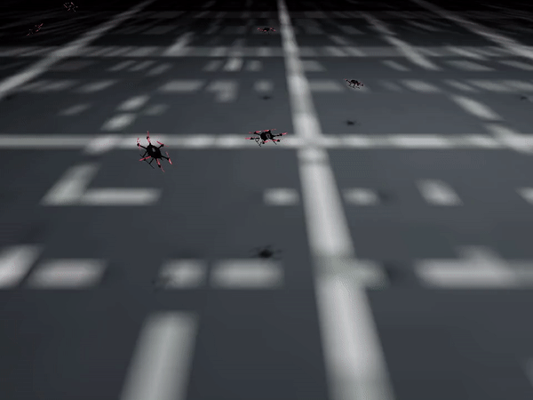
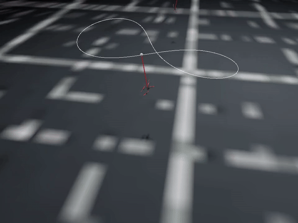
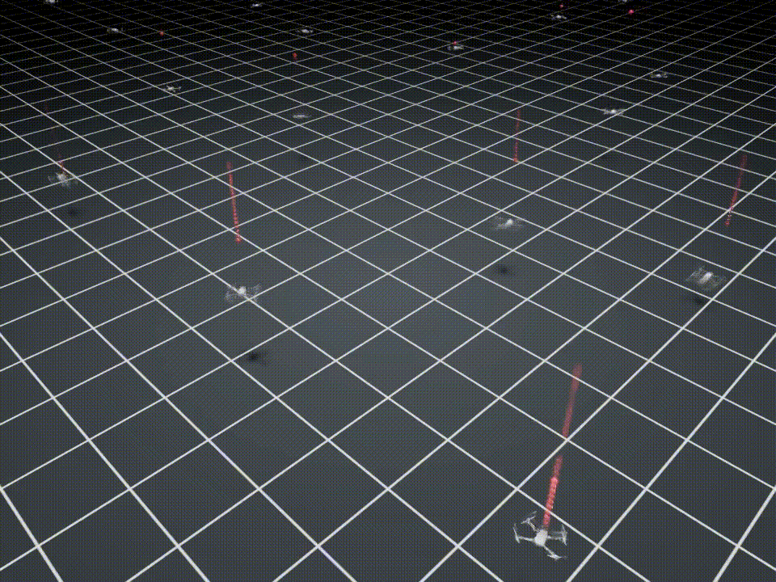

# Introduction
Multi-rotor drones and multi-drone systems are increasingly garnering attention from both industry and academia due to their remarkable agility and versatility. And recently, reinforcement learning (RL) has been successfully applied to drone control, improving the computational efficiency, agility and robustness of drone controllers. Efficient and flexible simulated environments play a crucial role in exploring the potential of RL in robotics control, since it prevents researchers from the costly and time-consuming real-world data collection through deploying drone systems. And it allows researchers to build up the problem of interest and effectively evaluate the algorithm.

However, existing simulators suffer from a various of issues, including:
* Low sampling efficiency
* Difficulties in customization
* Lacking support for rl policy depolyment

The NICS-EFC group at Tsinghua University developed an efficitnet and flexible simulation platform, OmniDrones for testing and depolying reinforcement learning in drone control, which stands out for several reasons:

Firsty, leveraging Nvidia's Isaac Sim, OmniDrones impressively achieves over **$10^5$** steps per second in data collection. This efficiency is pivotal for the successful application of large-scale RL-based methods.

Secondly, OmniDrones offers four default drone models that are commonly referenced in research and it provides four control modes and five sensor modalities, all of which are designed for easy modification and extension. The framework also accepts xacro files to make it easier for researchers to introduce customized dynamics properties and transfer their work into ROS operating system.  

Thirdly, OmniDrones boasts a comprehensive suite of more than 10 tasks for both single and multi-agent scenarios. These tasks, which span a range of challenges and difficulty levels, can be effortlessly expanded and are compatible with contemporary RL libraries.

Highlights of our **Omnidrones**
* Efficiency: over $10^5$ steps per second in data collection
* Flexibility: easy for users to import models and add customized dynamics 
* RL-Support: design tasks of varying challenges and difficulty levels for RL

## Benchmarking tasks
Based on the simulation framework, several benchmark tasks have been tested and received promising results. This section lists several benchmark tasks including both single agent contoller optimization and multi-agents cooperation tasks.
### Hover
In hovering task, the goal is to maintain a stable position and heading in mid-air without drifting. 

### Track for inverted pendulum system
The following is a track task designed for a drone-based inverted pendulum system. The goal is to track a reference lemniscate trajectory in the 3D space for the payload.

### Pong game
The idea of this task is from the Atari's video game Pong. The goal is to bounce the ball and keep it off the ground.

### Ping pong game
A multi-agent version of Pong game.

